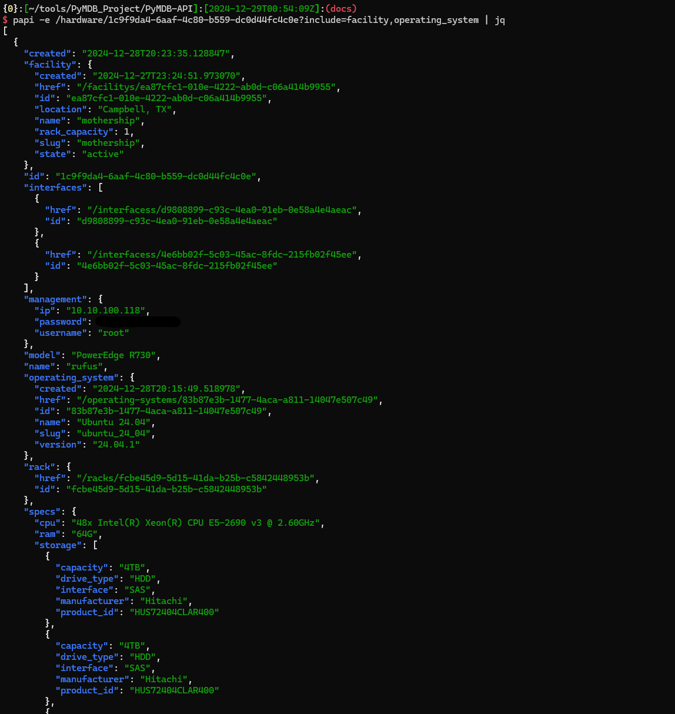

  
  <h1>PyMDB-API</h1>
  
  

    The API component for the PyMDB CMDB/DCIM project.
  

  
  
<!-- Badges -->

  
  
  
  
  
  

   
<h4>
    <a href="https://github.com/Py-MDB/PyMDB-API/">View Demo</a>
   · 
    <a href="https://github.com/Py-MDB/PyMDB-API">Documentation</a>
   · 
    <a href="https://github.com/Py-MDB/PyMDB-API/issues/">Report Bug</a>
   · 
    <a href="https://github.com/Py-MDB/PyMDB-API/issues/">Request Feature</a>
  </h4>

 

<!-- Table of Contents -->
# :notebook_with_decorative_cover: Table of Contents

- [About the Project](#star2-about-the-project)
  * [Screenshots](#camera-screenshots)
  * [Tech Stack](#space_invader-tech-stack)
  * [Features](#dart-features)
- [Getting Started](#toolbox-getting-started)
- [Usage](#eyes-usage)
- [Roadmap](#compass-roadmap)
- [Contributing](#wave-contributing)
<!-- - [FAQ](#grey_question-faq) -->
- [License](#warning-license)
- [Contact](#handshake-contact)
- [Acknowledgements](#gem-acknowledgements)

  

<!-- About the Project -->
## :star2: About the Project

<!-- Screenshots -->
### :camera: Screenshots

 
  

<!-- TechStack -->
### :space_invader: Tech Stack

  
API

  <ul>
    <li><a href="https://www.docker.com/">Docker</a></li>
    <li><a href="https://www.python.org/">Python</a></li>
    <li><a href="https://flask.palletsprojects.com/en/stable/">Flask</a></li>
  </ul>

Database

  <ul>
    <li><a href="https://www.mongodb.com/">MongoDB</a></li>
  </ul>

<!-- Features -->
### :dart: Features

- RESTful API for managing CMDB/DCIM data.
- Token-based authentication for secure access.
- Schema validation for input data integrity.
- Relationship management between different objects.

<!-- Getting Started -->
## 	:toolbox: Getting Started

For detailed information on setting up a development environment, see the [Development Guide](docs/development.md).

<!-- Usage -->
## :eyes: Usage

For more comprehensive usage documentation, see the [docs readme](docs/README.md)

<!-- Roadmap -->
## :compass: Roadmap

* [x] Create an API capable of creating, updating, deleting, and fetching database records.
* [x] Secure the API with token based auth.
* [x] Validate input data based on predetermined schemas.
* [x] Establish links between objects.
* [ ] Develop IPAM capabilities.
* [ ] Develop more comprehensive support of object types and links.
* [ ] Create front end UI.
* [ ] Create automation pipelines for executing commands on enrolled servers.
* [ ] Implement command execution capabilities to deploy and manage virtual machines on hypervisors using vendor-agnostic methods.

<!-- Contributing -->
## :wave: Contributing

Contributions are always welcome!

See [contributing.md](docs/contributing.md) for ways to get started.

<!-- FAQ -->
<!-- ## :grey_question: FAQ

- Question 1

  + Answer 1

- Question 2

  + Answer 2 -->

<!-- License -->
## :warning: License

Distributed under the Mozilla Public License 2.0. See [LICENSE](https://github.com/Py-MDB/PyMDB-API/blob/main/LICENSE) for more information.

<!-- Contact -->
## :handshake: Contact

Jesse Butryn - [linkedin](https://www.linkedin.com/in/jesse-butryn/) - jesse@jesseb.org

Project Link: [https://github.com/Py-MDB/PyMDB-API](https://github.com/Py-MDB/PyMDB-API)

<!-- Acknowledgments -->
## :gem: Acknowledgements

 - [Awesome README template](https://github.com/Louis3797/awesome-readme-template)

